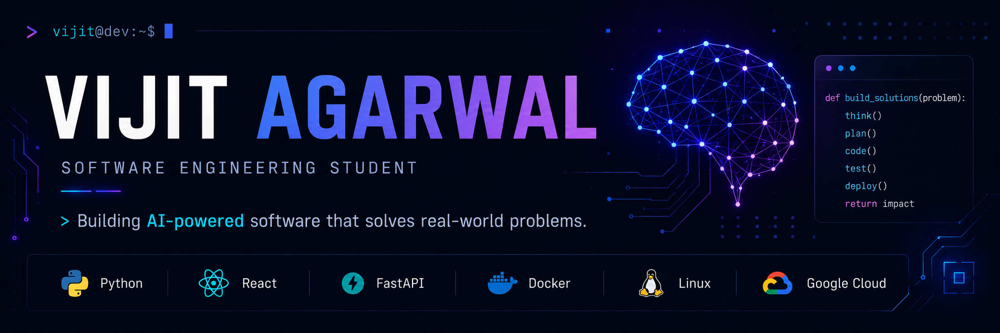

# Hi, I'm Vijit Agarwal 👋

### Software Engineering Student • Building intelligent software for real-world problems

---

# About

I'm a **Software Engineering student** at **Chanakya University** with a strong interest in building scalable software systems and solving real-world problems through thoughtful engineering.

Rather than chasing every new technology, I focus on building strong fundamentals in software engineering while using AI where it genuinely creates value. My interests span backend engineering, cloud technologies, machine learning, and modern software architecture.

---

# 🚀 Currently Building

* 🎯 FocusFriend — AI-powered productivity platform
* 🤖 Exploring production Machine Learning workflows
* ⚙️ Full Stack Applications
* 🐳 Docker & Containerized Development
* ☁️ Cloud Deployments
* 📚 Data Structures, Algorithms & System Design

---

# 🌟 Featured Projects

## 🎯 FocusFriend

AI-powered productivity platform designed to help users build better focus habits through analytics, Pomodoro sessions and personalized insights.

**Tech Stack:** React • FastAPI • PostgreSQL • Supabase • Tailwind CSS

---

## 📊 DataDarshanam

Conversational Business Intelligence dashboard that transforms natural language into actionable business insights.

**Tech Stack:** Python • FastAPI • Streamlit • PostgreSQL

---

## 🚀 MissionControl

A modern productivity platform focused on organizing work, improving execution and simplifying project management.

**Tech Stack:** React • Node.js • MongoDB

---

# 🛠 Tech Stack

### Languages

### Frontend

### Backend

### Databases

### Cloud & DevOps

### Tools

---

## 📊 GitHub Streak

  

  <i>Building consistently, one commit at a time.</i>

# 📊 Contribution Activity

---

---

# 🐍 Contribution Snake

<picture>
  <source media="(prefers-color-scheme: dark)" srcset="https://raw.githubusercontent.com/vijitagarwal/vijitagarwal/output/github-contribution-grid-snake-dark.svg">
  <source media="(prefers-color-scheme: light)" srcset="https://raw.githubusercontent.com/vijitagarwal/vijitagarwal/output/github-contribution-grid-snake.svg">
  
</picture>

# 🤝 Connect With Me

---

### *Building software that creates real-world impact.*

