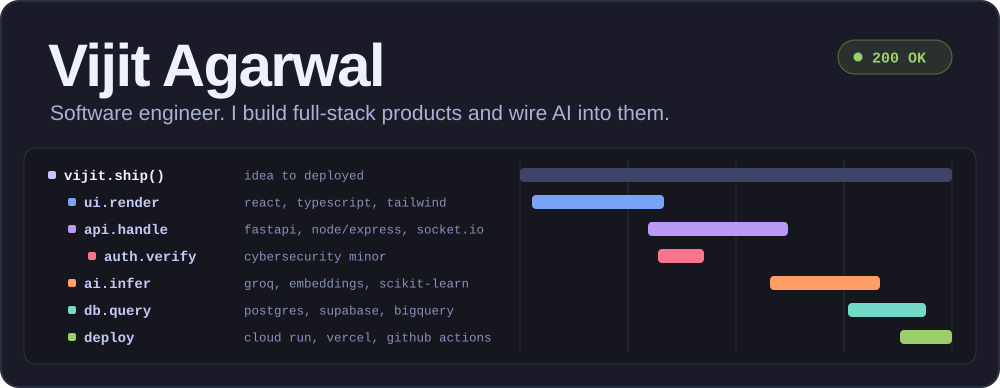
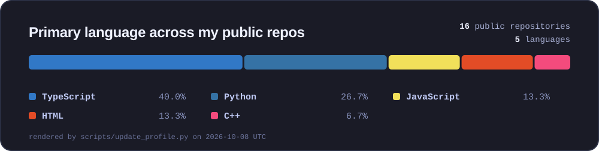

<div align="center">
  
</div>

<p align="center">
  <a href="https://linkedin.com/in/agarwalvijit"></a>
  <a href="https://x.com/VijitCodes"></a>
  <a href="mailto:vijitagarwal123@gmail.com"></a>
</p>

BCA student in Bengaluru (Software Engineering major, Cybersecurity minor). I build full-stack products and treat the AI part like any other dependency: it gets an interface, limits and a retry policy.

```yaml
now:
  building:
    - DataDarshanam   # plain-English questions in, dashboards out
    - ExamHabitat     # one engine, many exams
    - second-brain    # Markdown notes to a Neo4j knowledge graph
  learning:
    - ML from the math up
    - DSA and system design
```

## Selected work

### [DataDarshanam](https://github.com/vijitagarwal/DataDarshanam)

Ask a question about your data in plain English and get an interactive dashboard plus a short written takeaway. Started as a GFG hackathon build, now a full-stack rebuild.

- Groq (Llama 3.3 70B) parses the intent, Pandas does the aggregation, Plotly builds the chart. The numbers come from the data engine, not the model.
- Uploads are capped at 25 MB, 250k rows and 100 columns, and isolated per browser workspace. The README says plainly that this is isolation, not authentication.
- Multi-turn memory, live chart-type switching without re-querying, and saved insights that export as an HTML report.

`Next.js 16` `React 19` `TypeScript` `Tailwind v4` `FastAPI` `Pandas` `Plotly` `Groq`

### [Focus Friend](https://github.com/vijitagarwal/FocusFriend)

A focus tracker with a scoreboard: Pomodoro sessions, analytics and Groq-generated insights, deployed on Google Cloud Run.

- A custom Focus Score turns every session into one number you can compare.
- Real-time leaderboard over Socket.io.

`React` `Node.js` `Express` `PostgreSQL` `Socket.io` `Groq` `Cloud Run`

### [HabitHabitat](https://github.com/vijitagarwal/habithabitat)

A habit tracker and exam-prep cockpit built to be more rigorous than a checkbox list. [Live on Vercel](https://habithabitat.vercel.app); v1 is frozen and ExamHabitat is the rebuild.

- Three habit types (boolean, numeric with benchmark levels, stopwatch), plus build and limit habits that score themselves against thresholds.
- A custom `useSyncExternalStore` state engine, no Redux or Zustand. It debounce-syncs to Supabase and listens for realtime changes, so two devices stay in step.
- A focus timer in a Web Worker that survives tab backgrounding, a streak-freeze economy, XP and per-habit heatmaps.

`TanStack Start` `TypeScript` `Tailwind v4` `Supabase` `Recharts` `Vercel`

### [ExamHabitat](https://github.com/vijitagarwal/examhabitat)

The multi-exam rebuild of HabitHabitat: pick a target exam (CAT, NEET, JEE, UPSC, GATE or CLAT) and the whole dashboard adapts to it. In progress.

- Exam logic lives in data (`src/lib/exams`), not in components. The profile's `target_exam` drives the active exam's identity and theming.
- Supabase Auth and Postgres, with row-level security as a deployment requirement.
- Topic progress, mock scores and error logs per exam.

`TanStack Start` `React 19` `TypeScript` `Tailwind v4` `Supabase` `Framer Motion` `Vercel`

### [Second Brain](https://github.com/vijitagarwal/neo4j-graph---Second-brain)

Markdown notes in, knowledge graph out. A prototype pipeline that turns a folder of notes into a connected graph you can query and explore.

- Groq extracts entities and relationships as strict JSON; nodes and edges are written to Neo4j with `MERGE`, so re-runs don't duplicate them.
- Batch-aware ETL with retries on Groq rate limits (429) and alias normalisation, so "OS" and "Operating System" become one node.
- A Next.js dashboard is scaffolded for a 3D graph view.

`Node.js` `Neo4j` `Docker Compose` `Groq` `Next.js`

<details>
<summary><b>More projects</b></summary>

| Project | What it is | Stack |
|---|---|---|
| SecureVault | A learning project in applied cryptography and password hygiene | Flask, DES/CBC, bcrypt |
| DANS | ESP32-based disaster alert system with web and mobile apps | ESP32, React, Flutter, Node.js, MongoDB, Firebase, AWS |
| x-summarizer | Digests X bookmarks into a daily email | Playwright, Groq, Nodemailer, GitHub Actions cron |
| Chinese Checkers | Browser game with AI and multiplayer modes | HTML, CSS, JavaScript |

</details>

## Stack

| Area | Tools |
|---|---|
| **Languages** |  |
| **Frontend** |  |
| **Backend** |  |
| **Data** | <br>`BigQuery` `Neo4j` |
| **AI and ML** | <br>`pandas` `embeddings` `Groq API` `Plotly` |
| **Infra and tooling** |  |
| **Security** | `bcrypt` `DES/CBC` `row-level security` |

## Experience and education

| When | What |
|---|---|
| **Jul 2026** | ML engineering intern at FlyRank. Six weeks in the company's inaugural global AI internship cohort. |
| **2024–2028** | BCA at Chanakya University, Bengaluru. Software Engineering major, Cybersecurity minor. |
| **2026** | Event coordinator for the Web/App Dev Sprint at the OJAS 2026 student fest. |
| **Hackathons** | GFG Intercollege Hackfest, GFG Hackathon (DataDarshanam), Prompt-to-Product. |

## Activity

<p align="center">
  
</p>

<p align="center">
  <picture>
    <source media="(prefers-color-scheme: dark)" srcset="https://raw.githubusercontent.com/vijitagarwal/vijitagarwal/output/github-contribution-grid-snake-dark.svg">
    <source media="(prefers-color-scheme: light)" srcset="https://raw.githubusercontent.com/vijitagarwal/vijitagarwal/output/github-contribution-grid-snake.svg">
    
  </picture>
</p>

Working on something where the AI has to hold up inside a real product? [Say hi](mailto:vijitagarwal123@gmail.com).

<details>
<summary>How this page is built</summary>

- `assets/hero.svg` is hand-written SVG and CSS. The trace plays once on load, and a `prefers-reduced-motion` rule switches the animation off.
- `assets/stats.svg` is rendered by [`scripts/update_profile.py`](scripts/update_profile.py), standard library only, on a weekly GitHub Actions schedule ([workflow](.github/workflows/update-profile.yml)).
- The snake lives on the `output` branch. Badges and tech icons come from shields.io and skillicons.dev; anything that carries data is generated in this repo.

</details>

